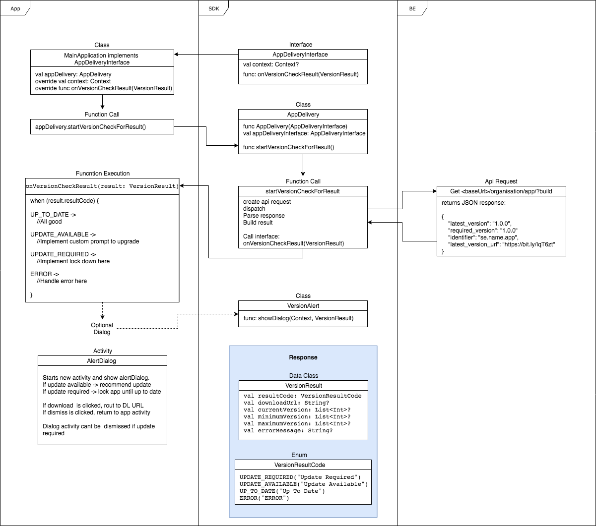

# as-appdelivery-android
SDK for distribution version control

# Usage
1. Add SDK to project
   - Import SDK 
     In Android Studio right click a module and select new -> module -> import .JAR/.AAR Package and navigate to where the .aar file is stored.
   - Add ':ModuleName' to include in settings.gradle
   - In app build.gradle add "implementation project(':app-delivery-sdk')" as a dependency

2. In the class you want to run the version check from (most likely the first activity) implement AppDeliveryInterface and override its members.

3. Create an Instance of AppDelivery(AppDeliveryInterface) and call its startVersionCheck().
   Once a result have been computed AppDelivery will call onVersionCheckResult() from the interface passed to the constructor.

4. In the interface class a VersionResult will be passed as the only parameter to onVersionCheckResult.
   This data class holds all relevant information and looks like this:
   INSERT STRUKT HERE JKLASJDÖO IASÅDIOSADIOASHIODHIOAHS IOD SDOIA ISD AS   <---------------

   The most important property is ResultCode which is an Enum:
   Insert ENUM HERE HASDHASHDHWUARHAHAGHRHRHAHGHERHRHAHGHAHAGHSHHWHERHGHH   <---------------

   Check which code status is returned and respond accordantly

   DONE!

5. Optional!
   If you dont wish to implement your own logic to handle version conflicts there is a default class calld AlertDialog.
   Just call the static function showDialog(Context, VersionResult) with the obtained VersionResult and a dialog will show prompting the user to update the app if needed.
   If the app does not meet the required version the AlertDialog will lock down the app until the required minimum version is met.

# Example

```
LaunchActivity : Activity(), AppDeliveryInterface {
	override val context: Context = this

	override fun onCreate(savedInstanceState: Bundle?) {
		super.onCreate(savedInstanceState)

		appDelivery = AppDelivery(this)
        Log.d("@dev onCreate", "layout completed")

        setupListeners()
        responseText.text = getString(R.string.FETCHING)
        appDelivery.startVersionCheck()
	}
}
```
# FlowChart

